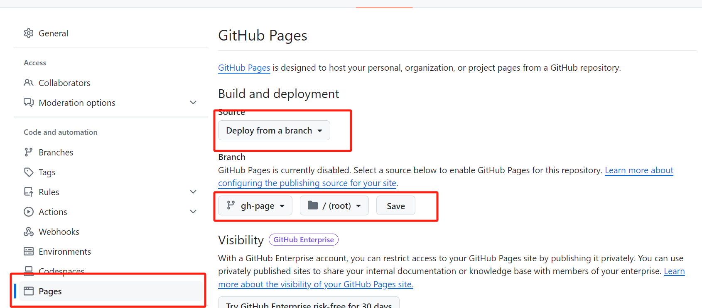

## About Me

I am a person with heavy procrastination symptoms, poor self-control, and a tendency to be lazy and easily satisfied. However, contrary to what my personality might suggest, I am not a 無藥可救 (hopeless) person. In fact, many of my relatives, friends, and even my girlfriend consider me to be excellent.

My life was relatively smooth for the first 19 years. Under pressure and with clear guidelines, I was able to perform well and often outcompete others in the given curriculum. Skills and knowledge were handed to me, and I learned them quickly, albeit passively.

Everything changed when I went to college. Suddenly, no one was forcing me to do anything; there were no heavy academic workloads and no packed schedules. I gained something I had never imagined—complete freedom. I could choose whatever I wanted: what to eat, when to sleep, what to play, which courses to take, and so on.

This newfound freedom made me panic. Unlike before, when I had a clear, designed path—go to a better high school, then get into a better university—I now had too many choices. Which field in my major did I want to focus on? What jobs did I want to pursue? Did I want to continue in academia and further my studies? If so, where should I go, and which field should I specialize in?

These questions constantly plagued my mind. Unlike math exams, there were no model answers for these life decisions. To be honest, I suffer from a degree of 選擇困難症 (decision paralysis). Faced with so many choices, I became overwhelmed and started procrastinating.

Fortunately, things have been getting better recently. I have slowly stepped out of my comfort zone and tried various activities: boxing, part-time jobs, internships, and...

**starting this blog**.

I had attempted blogging a few times before, but I was too lazy to maintain it, and the tools I used were more complicated than the ones I am using now. This time, I hope to succeed.

In this blog, I intend to document my technical notes, university-related issues, thoughts about the world, and interesting things around me. I would be really happy if my content can inspire those who read it.


## How I Built This Blog

Setting up this blog was a lot simpler than I imagined...

It only took me around **10 minutes** to have a demo page running on my local machine.

However, the difficulty can vary significantly depending on the theme you decide to use in the next step.

Similarly, depending on the host and the hosting method, the difficulty can range from 10 minutes to half a day, with most of the time spent on debugging.

Nevertheless, I approached constructing this blog using [Hugo](https://gohugo.io/), *the world's fastest framework for building websites*. It is truly the fastest, both in terms of deploy speed and construction speed. Additionally, I host the website using [GitHub Pages](https://pages.github.com/).

Now, I will demonstrate how this blog is built. For beginners, I recommend you to follow my steps one by one to get your page up and running first. This reduces the difficulty of identifying any potential bugs during the setup process.

The whole construction process consists of two sections: **hosting on a local machine** and **GitHub Pages**.

#### Prerequisites

1. Have a GitHub account.
2. Have Git installed.


### Hosting on local machine

1. **Install Hugo (https://www.youtube.com/watch?v=8BrADPJgA-4)**

**First,** 

Install the zip file from the release page: https://github.com/gohugoio/hugo/releases/tag/v0.127.0. 

Check two criteria: operating system, and hugo_extended.


Window users can install the one in the red box.

**Second,** 

Create folders according to this directory:

> D:\Program Files (x86)\Hugo\bin

This means you have to create a `Hugo` folder in program files, and create a `bin` folder in `Hugo`.

**After you've done so**, 

Unzip the file you downloaded and move all the files inside to `bin`.

Your `bin` folder should look like this:


**Third**, 

Open your search bar, type `edit environment variable`. In the panel, open environment variables in the advanced settings.

In the environment variables setting, find `path` in the system variables:


Edit, and create a new path. 

Paste the path where you stored your `bin` folder, for me, it is:

> D:\Program Files (x86)\Hugo\bin.

Try `hugo help` in your command prompt to see if Hugo is successfully installed.

If this is your output:


Congratulations, you have your Hugo installed.  

2. **Construct a demo page (https://gohugo.io/getting-started/quick-start/)**

Open **cmd** and switch to a directory where you want your Hugo folders for your website to be, here `desktop` is used for better demonstration. 

```text
cd desktop
```

Verify that you have installed Hugo v0.112.0 or later.

```text
hugo version
```

Run these commands to create a Hugo site with the [Ananke](https://github.com/theNewDynamic/gohugo-theme-ananke) theme. 

```text
hugo new site quickstart
cd quickstart
git init
git submodule add https://github.com/theNewDynamic/gohugo-theme-ananke.git themes/ananke
echo "theme = 'ananke'" >> hugo.toml
hugo server
```

View your site at the URL displayed in your terminal. Press `Ctrl + C` to stop Hugo's development server.

Due to an unknown issue, my `hugo.toml` file is inserted with random characters. So if you experience the same issue, open the file with your **VS code**.

Remove strange characters and add the line `theme = 'ananke'`manually.

*For more information, view the Hugo official documentation (https://gohugo.io/getting-started/quick-start/)*

3. **Add themes**

While you can follow the theme I used, you can also look for other themes on https://themes.gohugo.io/, or check the GitHub-styled theme my friend Anton used, here is [his blog](https://awepo-pro.github.io/post/github-page/).

Run these commands to run your Hugo site with the [terminal](https://github.com/techbarrack/terminal-hugo-theme) theme. 
```text
git submodule add https://github.com/techbarrack/terminal-hugo-theme.git themes/terminal
copy ".\themes\terminal\hugo.yaml" ".\"
del ".\hugo.toml"
mkdir -p layouts/partials/third_party_js
hugo server --buildDrafts --disableFastRender --gc --ignoreCache --noHTTPCache --forceSyncStatic --verbose -w
```

View your site at the URL displayed in your terminal. Press `Ctrl + C` to stop Hugo's development server. 

Customize the website by modifying files in the terminal file.

### Hosting on GitHub

#### Before starting, ensure you:

1. Know how to set up a GitHub page
2. Created an empty GitHub repository using the GitHub page naming rule

#### Steps

**First of all**, ensure you are in the `quickstart` folder, and open cmd. 

Run the following commands to push your local repository to your remote repository.```text
git add .
git commit -m "init"
git remote add origin {replace this with your repo URL}
git remote -v
git push -u origin master```

**Then**, 

Run the following commands to create a workflow file which automatically deploys your blog. 
```text
mkdir -p .github/workflows
cd .github/workflows
touch deploy.yml
echo "name: Deploy website

on:  push:
    branches:
      - main  pull_request:

jobs:  deploy:
    runs-on: ubuntu-22.04
    steps:
      - name: Checkout repository
        uses: actions/checkout@v3

      - name: Deploy
        if: github.ref == 'refs/heads/main'
        uses: peaceiris/actions-gh-pages@v3
        with:
          github_token: \${{ secrets.GITHUB_TOKEN }}
          publish_dir: ./public # Deploy src folder
" >> deploy.yml
```

Then, open your GitHub repository, create a `gh-page` branch to hold the deployed HTML files. 

Go to settings, and change the setting accordingly.

Run the following commands to push the workflow to your remote repository.

```text
git add .
git commit -m "workflow set-up"
git push
```

AND

your blog should be successfully hosted!

*If it is still not working, consider directly cloning [my blog](https://github.com/stephenlamonline/stephenlamonline.github.io.)*
